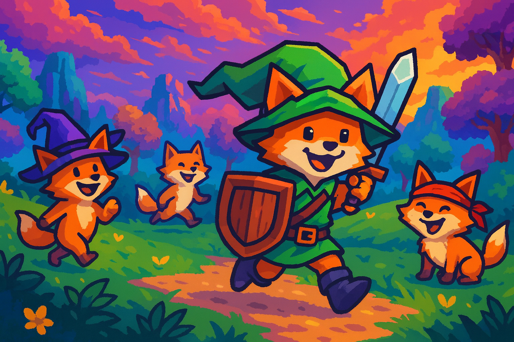

<!-- COMING_SOON.md -->

<h1 align="center">NAVI CV — “Hey! Listen!” 🎮💼</h1>

  The <em>world’s first</em> <strong>open-source, multimodal, gamified</strong> job platform built <em>specifically</em> for the video-game industry.
   Free. No strings. No gacha. Only jobs.

  
  
  
  
  

---

## 🧭 TL;DR

**NAVI CV** helps you **find game-industry jobs**, **tailor ATS-ready resumes/CVs**, **run mock interviews with studio personas**, **get career coaching**, **peek studio intel**, and **ship a slick portfolio**—all with **real-time, multimodal Gemini** smarts. It’s open source, local-first, and delightfully opinionated about games. You’ve never been quite so *Hyrule-hirable*.

---

## 🧩 What’s Coming (and why you’ll care)

- **Game-specific Job Search + Studio Intel**  
  Target roles across QA, Design, Engineering, Art, Audio, Production, Community, Live Ops—plus studio stacks, engines, and pipelines.  
- **Resume/CV Customizer (ATS-friendly)**  
  Convert jams, mods, raids, and shipped content into quantified impact bullets for actual hiring humans (and their bots).  
- **Mock Interviews with Studio Personas**  
  Producer screen? Systems design? Tools engineer? Practice in **real time** with role-aware prompts that already know your resume.  
- **Portfolio Creator (clips, screenshots, write-ups)**  
  Ship a clean, clickable portfolio for Unity/Unreal/Godot projects, art reels, audio demos, and tech breakdowns.  
- **Coach Mode**  
  “What should I improve for a gameplay programmer role at Studio X?” Get step-by-step, game-aware guidance.  
- **Multimodal, Real-Time**  
  Voice in, voice out; video & screen analysis for reviews, whiteboards, and design docs.  
- **Gamified Everything**  
  XP, streaks, achievements, daily challenges—because the grind should at least be fun.  
- **Free, No Strings**  
  Bring your own **Google AI Studio** key; generous free tier for personal use. Your data stays on your device. No accounts, no upsells, no loot boxes.

> **Zelda check:** Hookshot to hired. Boomerang your rejections. Triforce those keywords. Master Sword your bullets. (We contain multitudes.)

---

## 🛠️ Under the Hood (peek)

- **Stack**: Vue 3 + Vite + Electron, Type-safe IPC, secure preload, local storage for keys.  
- **AI**: Google **Gemini** (text, audio, and vision) for generation, mapping, and interviews.  
- **Multimodal**: Live video & screen-sharing with frame-by-frame AI insights.  
- **Privacy**: Local-first; only what you choose is sent to AI; keys never committed.

---

## 🗺️ Roadmap to Launch

- **Alpha**: Job search + resume/CV customizer + interview personas + portfolio builder  
- **Beta**: Studio intel expansions, saved searches, pipelines, and portfolio themes  
- **1.0**: Alerts, exports, integrations (LinkedIn/Lever/Greenhouse), community templates  
- **Nice-to-Have But We’ll Probably Ship Anyway**: Boss-rush interview mode, “Producer Panic” time trials, and a Sheikah-sleek UI theme

---

## 💖 How to Help (or just vibe)

- ⭐ Star the repo and watch for drops  
- 🐛 File issues, request features, or submit PRs  
- 🎨 Share templates (resumes, portfolios, interview banks)  
- 🎥 Post “from jam to job” success stories

---

## 📣 Call for Studios & Recruiters

Want better signal and happier candidates? Open an issue to add your **personas**, **pipelines**, and **best-practice prompts**. We’ll make it painless (and a little bit fun).

---

## 🧾 License & Credits
- Dr. Brandon Donnelly (Happy Mask Salesman)
- **Code**: MIT (free as in freedom and rupees)  
- **AI**: Uses your **Google AI Studio** key; real-time conversations powered by Gemini (free tier available).  
- **Name**: NAVI CV — because sometimes you really do need a tiny glowing helper yelling “Hey! Listen!”

<em>“You’ve never been quite so Breath-of-the-Hired.”</em>

