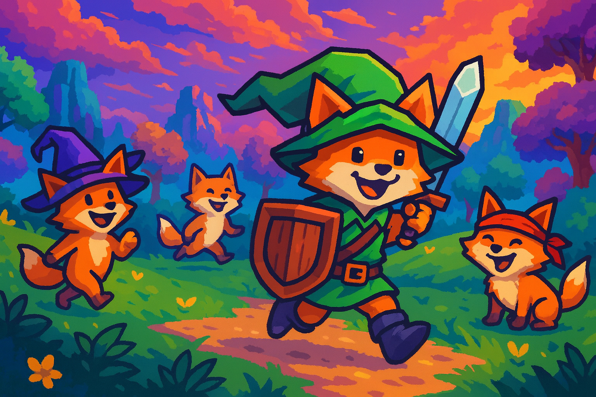

# NAVI - AI-Powered Gaming Career Assistant

  <h1 align="center">HEY! LISTEN!</h1>

  The <em>world's first</em> <strong>source-available (noncommercial), multimodal, gamified</strong> job platform built <em>specifically</em> for the video-game industry. 
  Free. No strings. No gacha. Only jobs.

  
  
  
  
  

---

## 📖 Table of Contents

- [TL;DR](#-tldr)
- [Features](#-features)
- [What's Coming](#-whats-coming)
- [Installation](#-installation)
- [Usage](#-usage)
- [Contributing](#-contributing)
- [License](#-license)
- [Credits](#-credits)

---

## 🧭 TL;DR

**NAVI** helps you **find game-industry jobs**, **tailor ATS-ready resumes/CVs**, **run mock interviews with studio personas**, **get career coaching**, **peek studio intel**, and **ship a slick portfolio**—all with **real-time, multimodal Gemini** smarts. It's source-available (noncommercial), local-first, and delightfully opinionated about games. You've never been quite so *Hyrule-hirable*.

---

## 🎯 Features

### 🎮 Gaming Career Dashboard with Full AI Integration

**NEW v1.3.0**: Complete gamification system with XP progression, daily missions, and achievement unlocks. Track your career progress with a comprehensive dashboard featuring real-time job matching, AI-powered insights, and personalized recommendations designed specifically for game industry professionals.

### 🤖 AI-Powered Interview Preparation System

**NEW**: Master gaming industry interviews with our comprehensive preparation system featuring AI-generated questions, mock interview simulations, real-time feedback, and performance analytics. Practice with studio-specific personas and get detailed insights on your readiness for different roles.

### 🧠 AI Modal System - Unified Intelligence Interface

**NEW**: Revolutionary AI assistance system providing context-aware suggestions, real-time analysis, and interactive chat support. The floating AI assistant adapts to your current activity and provides intelligent recommendations throughout your career journey.

### 📄 Resume Builder with Real-Time AI Optimization

**ENHANCED**: Create ATS-optimized resumes with live AI feedback, gaming industry-specific templates, and intelligent content suggestions. Real-time scoring and improvement recommendations ensure your resume stands out to gaming industry recruiters.

### 📊 Provider Health Dashboard

**NEW**: Real-time monitoring of all job sources with comprehensive health metrics and automatic failover. Track provider performance, response times, and reliability with visual status indicators.

**Latest Features:**
- 🟢 **Health Status**: Visual indicators for provider health (healthy/degraded/failed)
- 📈 **Performance Metrics**: Response times, success rates, and failure tracking
- 🔄 **Auto-Recovery**: Automatic provider disabling/re-enabling based on health
- ⚙️ **Provider Management**: Manual reset and enable/disable controls
- 📊 **System Overview**: Real-time summary of overall system health

### 🎮 Job Search & Industry Focus

**IMPROVED**: Search gaming industry roles with specialized filters for engines (Unity, Unreal, Godot), platforms, and role types. Real-time job aggregation from multiple sources with enhanced error handling and visual feedback.

**New Features:**
- 🔍 **Smart Search**: Enhanced fuzzy matching with gaming industry keywords
- 🤖 **AI Job Matching**: Advanced compatibility algorithm with confidence scoring and detailed reasoning
- 📊 **Live Data Verification**: Real-time source health monitoring with automatic failover
- 🎨 **Consistent UI**: Standardized components across all pages with gaming-inspired design

### 📄 AI-Powered Document Builder

**ENHANCED**: Create ATS-optimized resumes and cover letters with comprehensive AI assistance, real-time feedback, gaming industry templates, and intelligent content optimization.

**New AI Features:**
- 🤖 **Real-time Analysis**: Live content scoring and improvement suggestions
- 📊 **ATS Optimization**: Automatic keyword analysis and formatting improvements
- 🎯 **Job Targeting**: Tailor documents to specific job requirements
- 📈 **Progress Tracking**: Monitor completion status and quality metrics

### 🎨 Portfolio Showcase

**ENHANCED**: Showcase your game projects, contributions, and achievements with multimedia support, AI-powered descriptions, and technology-based organization.

**New Features:**
- 🤖 **AI Content Enhancement**: Automated project descriptions and achievement highlighting
- 🎮 **Gaming Project Templates**: Specialized layouts for different types of game development work
- 📊 **Impact Quantification**: AI-assisted metrics and achievement measurement
- 🔗 **Smart Linking**: Automatic integration with job applications and resume content

### ⚙️ Settings & AI Configuration

**ENHANCED**: Configure AI features, manage your profile, and customize the experience with comprehensive settings, advanced AI model selection, and privacy controls.

**New AI Features:**
- 🤖 **AI Model Configuration**: Choose between different AI providers and models
- 📊 **Usage Analytics**: Monitor AI interactions and optimization suggestions
- 🎯 **Context Management**: Control how AI learns from your interactions
- 🔒 **Privacy Controls**: Advanced data management and sharing preferences

> 🎮 **[See the complete feature list with detailed screenshots →](featurelist.md)**

---

## 🚀 What's Coming (and why you'll care)

- **Game-specific Job Search + Studio Intel**: Target roles across QA, Design, Engineering, Art, Audio, Production, Community, Live Ops—plus studio stacks, engines, and pipelines.
- **Resume/CV Customizer (ATS-friendly)**: Convert jams, mods, raids, and shipped content into quantified impact bullets for actual hiring humans (and their bots).
- **Mock Interviews with Studio Personas**: Producer screen? Systems design? Tools engineer? Practice in **real time** with role-aware prompts that already know your resume.
- **Portfolio Creator (clips, screenshots, write-ups)**: Ship a clean, clickable portfolio for Unity/Unreal/Godot projects, art reels, audio demos, and tech breakdowns.
- **Coach Mode**: "What should I improve for a gameplay programmer role at Studio X?" Get step-by-step, game-aware guidance.
- **Multimodal, Real-Time**: Voice in, voice out; video & screen analysis for reviews, whiteboards, and design docs.
- **Gamified Everything**: XP, streaks, achievements, daily challenges—because the grind should at least be fun.
- **Free, No Strings**: Bring your own **Google AI Studio** key; generous free tier for personal use. Your data stays on your device. No accounts, no upsells, no loot boxes.

> **Zelda check:** Hookshot to hired. Boomerang your rejections. Triforce those keywords. Master Sword your bullets. (We contain multitudes.)

---

## 🛠️ Under the Hood (peek)

- **Stack**: Vue 3 + Vite + Electron, Type-safe IPC, secure preload, local storage for keys.
- **AI**: Google **Gemini** (text, audio, and vision) for generation, mapping, and interviews.
- **Multimodal**: Live video & screen-sharing with frame-by-frame AI insights.
- **Privacy**: Local-first; only what you choose is sent to AI; keys never committed.

---

## 📦 Installation

### Prerequisites

- Node.js >= 18 (20 LTS recommended)
- npm 9+ (bundled with Node installs)
- For native modules on Windows (better-sqlite3, keytar):
  - Python 3 (added to PATH)
  - Visual Studio Build Tools (C++ Desktop workload)

### Quick Start (Desktop/Electron)

- Clone and install: `npm install`
- Dev mode (starts Vite + Electron): `npm run electron-dev`
- Production preview (local build): `npm run build && npm run electron`
- Package installers (Win/Mac/Linux): `npm run electron-build`

### Quick Start (Web Only)

- Dev server: `npm run dev` then open the shown URL
- Preview a production build: `npm run build && npm run preview`

### Notes

- To use a custom dev port for Electron: `VITE_PORT=5180 npm run electron-dev:port`
- App settings persist locally; API keys are stored on your device and never committed.
- First run may take a minute while dependencies build native modules.

### Troubleshooting

- If Electron can't find the dev server, ensure Vite is running on the same port or use `electron-dev` which starts both.
- Clear caches on odd rebuild issues: `npm run clean` (or `clean:all` to remove `node_modules`).
- Windows PowerShell users may prefer `electron-dev` over `electron-dev:port` due to shell env syntax differences.
- Rebuild native modules for Electron if launch fails: `npm run rebuild:native`

---

## 🚀 Usage

### Gaming Job Board Setup

- Configure Gemini: In-app go to Settings and paste your Google AI Studio API key (uses gemini-2.5-flash by default).
- Enable studio job sources: Edit `src/services/providers/companyBoards.ts` to add or tweak ATS board tokens (Greenhouse/Lever). A few popular studios are prefilled.
- Run locally:
  - Web: `npm run dev` (open Job Board view)
  - Desktop: `npm run electron-dev`
- Search and AI match: Use the Job Board to search; click "AI Job Matching" to rank jobs to your profile using Gemini.

### Notes

- The job aggregator includes source-available (noncommercial) plus per-studio ATS providers (Greenhouse, Lever, etc.). If a studio returns empty results, verify the token by visiting its public board URL (see comments in `companyBoards.ts`).
- You can extend providers or change priorities via the pluggable registry in `src/services/RefactoredJobAPIService.ts`.

### Update (Jobs Platform Consolidation)

- Canonical job route is `/jobs`. Any `/gaming-jobs` links now point to the same unified implementation.
- Canonical job service is `src/services/CanonicalJobService.ts` (re-exports the provider-based service).
- Page pointers are de-duplicated; all job board references resolve to the unified JobSearch view.
- Theme aligns to a black/white glass design with RGB neon accents for hover/focus.

---

## 🗺️ Roadmap to Launch

- **Alpha**: Job search + resume/CV customizer + interview personas + portfolio builder
- **Beta**: Studio intel expansions, saved searches, pipelines, and portfolio themes
- **1.0**: Alerts, exports, integrations (LinkedIn/Lever/Greenhouse), community templates
- **Nice-to-Have But We'll Probably Ship Anyway**: Boss-rush interview mode, "Producer Panic" time trials, and a Sheikah-sleek UI theme

---

## 💖 How to Help (or just vibe)

- ⭐ Star the repo and watch for drops
- 🐛 File issues, request features, or submit PRs
- 🎨 Share templates (resumes, portfolios, interview banks)
- 🎥 Post "from jam to job" success stories

---

## 📣 Call for Studios & Recruiters

Want better signal and happier candidates? Open an issue to add your **personas**, **pipelines**, and **best-practice prompts**. We'll make it painless (and a little bit fun).

---

## 🧾 License & Credits

- **Dr. Brandon Donnelly (Happy Mask Salesman)** — LinkedIn: [https://www.linkedin.com/in/stracos](https://www.linkedin.com/in/stracos)
- **License**: Navi AI NonCommercial Public License v1.1 (SPDX: LicenseRef-NaviAI-NCPL-1.1). Source-available, noncommercial; not an OSI-approved source-available (noncommercial) license.
- **AI**: Uses your **Google AI Studio** key; real-time conversations powered by Gemini (free tier available).
- **Name**: NAVI CV — because sometimes you really do need a tiny glowing helper yelling "Hey! Listen!"

### Community

- Discord: [https://discord.gg/6p52QZ2sAm](https://discord.gg/6p52QZ2sAm)

<em>"You've never been quite so Breath-of-the-Hired."</em>

---

## Repository Layout

See [DIRECTORY.md](DIRECTORY.md) for the full repo structure, where scripts/tests/demos live, and how to run them after the reorganization.